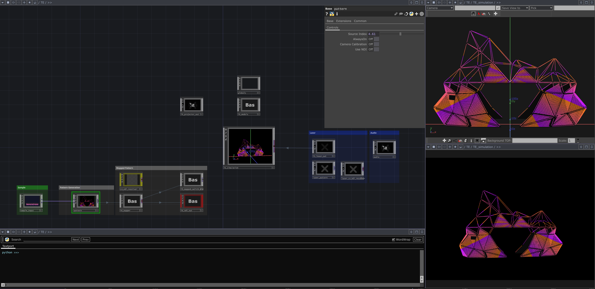
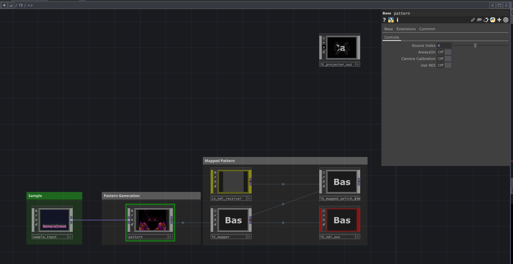
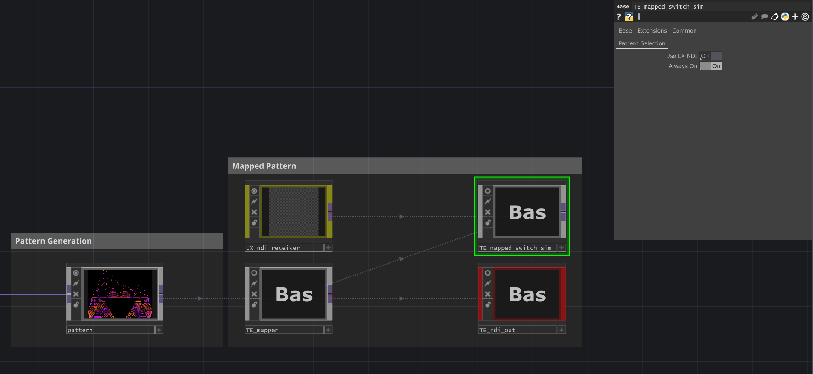

# TouchDesigner-TE
This repository contains the TouchDesigner engine used to perform various 
tasks for Titanic's End Art Car.

## Table of Contents
1. [TouchDesigner-TE](#touchdesigner-te)
2. [Features](#features)
   - [Pixel Mapping](#pixel-mapping)
   - [Pixel Remapping and Simulation](#pixel-remapping-and-simulation)
   - [Projection Mapping](#projection-mapping)
   - [Laser Mapping](#laser-mapping)
3. [Usage](#usage)
   - [Pixel Mapping and Pattern Selection](#pixel-mapping-and-pattern-selection)
   - [Model Config and Model Selection](#model-config-and-model-selection)
4. [Pattern Selection Note to the Artists](#pattern-selection-note-to-the-artists)

## Features

The main software is the TE-Engine project and currently implements the 
following operations:

- **Pixel Mapping**: TE-Engine performs a full pixel mapping of the art car. 
  This can be used to map any texture onto the art car's pixels. The pixel 
  mapping is accompanied by a pattern running in the LXStudio software that 
  receives the pixel values over NDI from TE-Engine and displays them on the 
  car.
- **Pixel Remapping and Simulation**: TE-Engine can receive an NDI stream from 
  the LXStudio software and map the incoming NDI stream onto a 3D model used for 
  visualization and projection mapping. The TE-Engine app has a full 3D 
  simulation of the car and can be used to show data coming from LXStudio or 
  natively generated patterns in TouchDesigner.
- **Projection Mapping**: TE-Engine implements a full 3D camera-based projection 
  mapping that can be used to receive data from LXStudio or native TouchDesigner 
  patterns and project the model onto a 2D or 3D surface resembling the art car.
- **Laser Mapping**: TE-Engine implements a laser projection stack that can 
  receive laser patterns from LXStudio or native TouchDesigner laser patterns 
  and communicates them to Pangolin to display them on the lasers.

**Note 1**: The laser projection and the projection mapping components are 
using the same 3D models and hence can be used in one projection. This was 
tested by projecting the panel data using a regular projector and the edge data 
using a laser unit onto the same surface to form a single image.

**Note 2**: Projection mapping and laser mapping components are experimental 
features and are currently **disabled** in the TouchDesigner project. If needed, 
they can be enabled and used for one-off projects.

## Usage
Here we will describe some of the main operations that can be done in the 
TE-Engine app.

### Pixel Mapping and Pattern Selection
The TE-Engine app performs a full pixel mapping of the Titanic's End car and can 
be used to send pixel data to the LXStudio software over NDI.

The workflow for this is as follows:
1. Open the TE-Engine app in TouchDesigner.
2. Select the "pattern" component in the bottom left corner of the network.
3. Choose the `Source Index` in the parameters of this component.
4. The pattern selected in the `pattern` component will be mapped to the art 
   car's pixels in the `TE_mapper` component.
5. The mapped pattern will be sent over NDI to LXStudio from the `TE_ndi_out` 
   component.

Note: If the `TE_mapped_switch_sim` component's parameter `Use LX NDI` is on, 
the simulation in TouchDesigner will show the content it receives from LXStudio 
instead of the mapped patterns from the `TE_mapper` component.

### Model Config and Model Selection
The models are primarily handled and updated in the LXStudio app. We have custom 
code that exports the models to a set of CSV and PNG files when they are 
updated. In TouchDesigner, we are checking for changes in the model files and 
reloading them on any change.

The changes should not happen during show time and mainly occur during the 
initial setup of the car. So the model reload will not be a performance issue 
for the TouchDesigner engine.

To choose the models, you need to configure the `config/models.yaml` file and 
point the `models_dir` to the `LXStudio-TE/resources/models` folder. On startup, 
the TE-Engine app will read the models and start monitoring them for changes.

## Pattern Selection Note to the Artists
This app is designed to act as an engine, not a user-facing software. This is to 
keep the control surface of the art car in one place, which is in the LXStudio 
software. This means that pattern selection should be implemented by the 
artists or in collaboration with the Titanic's End developers to integrate new 
patterns generated in TouchDesigner with the LXStudio software.